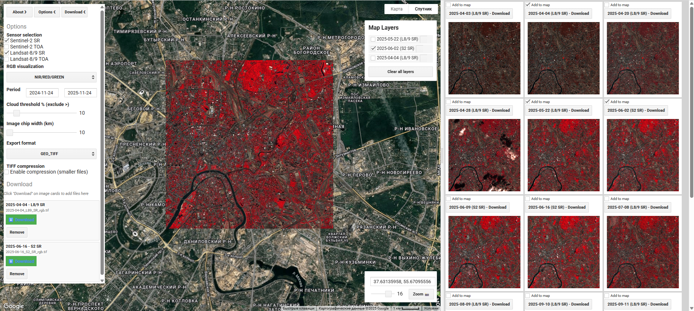
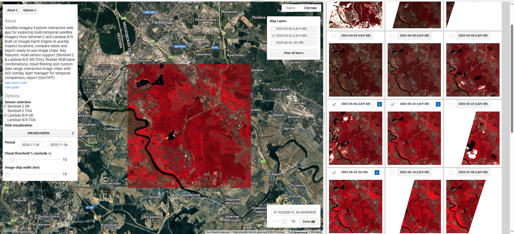
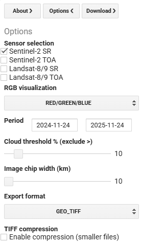
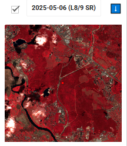
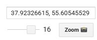

# MIIGAiK - TerraFrame
> Руководство пользователя
> 
---

## 1. Запуск приложения

### Перейдите в Демо

  
   

### или:
1. Перейдите в: `https://code.earthengine.google.com/` и вставьте код из `MIIGAiK-TerraFrame.js`.

2. Нажмите кнопку **Run** в верхней части Code Editor.

3. Появится карта и панель миниатюр, слева — панели **About / Options / Download**.

---

## 2. Основные элементы интерфейса

- **Карта** — выбор точки, просмотр слоёв.

- **Верхняя левая панель** — вкладки:
    - **About** — краткое описание и ссылка на GitHub.
    - **Options** — настройки сенсоров, дат, облачности и размера чипа.
- **Правая верхняя панель** — управление слоями карты (включение/выключение, очистка).

- **Нижняя правая панель** — быстрое масштабирование по координатам.
- **Боковая выдвижная панель** — просмотр и скачивание снимков, а также добавление снимка в список слоев

Интерфейс до выбора точки интереса:

Интерфейс после выбора точки интереса и параметров:

---

## 3. Настройка параметров (панель Options)

Откройте вкладку **Options**.

- **Sensor selection** — выберите один или несколько источников:

    - `Sentinel‑2 SR / TOA`

    - `Landsat‑8/9 SR / TOA`
    - **RGB visualization** — выберите комбинацию каналов:
    - `RED/GREEN/BLUE`.
    - **Period** — введите начальную и конечную дату в формате `YYYY‑MM‑DD`.
    - **Cloud threshold % (exclude >)** — максимальная допустимая облачность.
    - **Image chip width (km)** — размер чипа вокруг точки клика.

После изменения настроек нажмите **Submit changes**, чтобы перестроить список снимков.

---

## 4. Просмотр и скачивание снимков

1. Кликните по карте в интересующей области.
2. Приложение построит круг AOI и прямоугольник чипа вокруг точки.
3. В правой выдвижной панели появится лента карточек со снимками, отсортированных по дате и сенсору.

Каждая карточка содержит:

- миниатюру сцены с выделенным AOI;
- чекбокс — добавить выбранный снимок как слой на карту;
- кнопку с датой и сенсором — подготовить ссылку на скачивание.
- кнопку '⬇️' - скачать снимок (появится после нажатия на кнопку с датой и сенсором )

---

## 5. Управление слоями карты

Правая верхняя панель **Map Layers** отображает все добавленные слои.

- Для каждого слоя есть:
    - чекбокс видимости ;
    - кнопка удаления слоя (справа);
    - Кнопка **Clear all layers** удаляет все слои сразу.

Это удобно для сравнения разных дат и сенсоров над одной и той же территорией.

---

## 6. Быстрое масштабирование по координатам

В правом нижнем углу:

- поле **Координаты** — формат `долгота, широта`;
- ползунок **Zoom** — уровень масштабирования;
- кнопка **Zoom 📸** — центрирует карту на указанных координатах.

---

